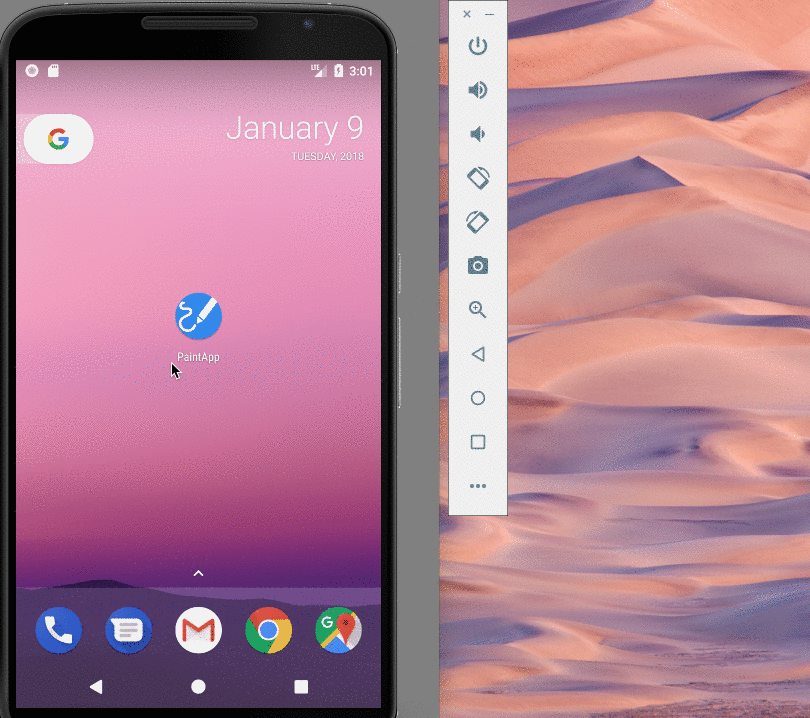

# paintApp

## User Stories

The following functionality is completed:
* [X] Created a custom PaintView
* [X] Made a network call to imgur, to save the drawn image, without using any third party libraries
* [X] User can change the color of the paint brush
* [X] User can clear the canvas
* [X] User can view the saved image in a custom chrome tab
* [X] Changed app icon and theme
* [X] Retaining the network call during configuration changes

## Video Walkthrough 

Here's a walkthrough of implemented user stories:

